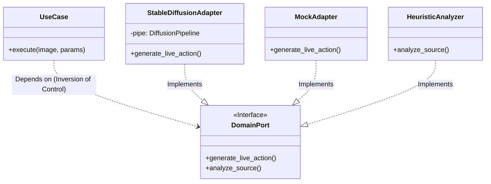
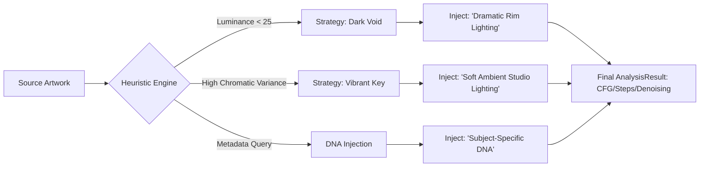

# 🐉 Z-Realism AI: High-Fidelity Neural Production Studio (v1.0.0)

[](https://www.docker.com/)
[](https://nginx.org/)
[](https://fastapi.tiangolo.com/)
[](#-performance-engineering-the-gtx-1060-benchmark)
[](#internationalization-i18n)
[](#system-architecture-hexagonal--ddd)
[](LICENSE)

**Z-Realism AI** is a professional-grade production studio engineered for the photorealistic synthesis of 2D artistic assets into high-fidelity "Live Action" visuals. Optimized for both static imagery and cinematic motion, the system utilizes a **Unified Gateway Architecture** to deliver a seamless experience on global networks.

**Author:** Enrique González Gutiérrez <enrique.gonzalez.gutierrez@gmail.com>

---

## 🚀 Commercial Value Proposition

The core strength of Z-Realism lies in its **Subject DNA Preservation** protocol. Unlike generic AI models, our system anchors the original identity, colors, and structure of your artwork, transforming it into reality without losing the essence of the creator's vision.

*   **Agnostic Material Synthesis:** Translates artistic colors into realistic textures (skin, fabric, metal) using a post-inference **Linear Chromatic Anchor**.
*   **Dual-Anchor Structural Logic:** Combines **Depth-Mapping** and **Canny Edge Detection** for 1:1 geometric alignment.
*   **Extreme Hardware Efficiency:** Achieves **3.0s/it** on 6GB VRAM cards via proprietary orchestration.

---

## 🏗 System Architecture (Hexagonal / Clean Architecture)

The system is designed using **Domain-Driven Design (DDD)** and **Hexagonal Architecture** to ensure that the neural core remains independent of external technical details.

### Infrastructure Manifold (Unified Gateway)


### Internal Domain Logic (Ports & Adapters)

By decoupling interfaces (Ports) from implementations (Adapters), the system supports both high-fidelity CUDA inference and simulated "Mock" modes for development.



---

## 👁️ Heuristic Intelligence Layer

Z-Realism features an **Expert Analytical Engine** that scans the source artwork's DNA before triggering the diffusion process. This allows for context-aware parameter injection based on computer vision metrics.



### 🧬 Subject DNA Metadata
The system includes a hierarchical **Metadata Dispatcher**. By mapping character names to JSON profiles, the engine automatically adjusts Canny thresholds (critical for subjects like blonde hair) and facial prompts to ensure consistent identity preservation.

---

## ⚡ Performance Engineering (The GTX 1060 Benchmark)

To democratize high-fidelity AI, Z-Realism implements a custom optimization layer that allows professional results on legacy 6GB hardware.

| Optimization Technique | Technical Implementation | Impact |
| :--- | :--- | :--- |
| **xFormers Attention** | Efficient $O(N)$ Attention algorithms. | Eliminates VRAM Swapping. |
| **Channels Last Memory** | `(N, H, W, C)` memory alignment for Tensor Cores. | **20% Speed Boost** on CNNs. |
| **CuDNN Benchmarking** | Runtime algorithm auto-tuning. | Minimizes inference latency. |
| **Sequential Offloading** | Dynamic module swapping (UNet/VAE) to RAM. | Enables Video gen on 6GB cards. |

> **Performance:** Inference time reduced from **19.0s/it** to **~3.0s/it** on GTX 1060.

---

## 🛠 Tech Stack

- **Inference Engine:** PyTorch 2.3 (CUDA 12.1), xFormers, Diffusers (SD 1.5 / AnimateDiff).
- **Architecture:** Hexagonal (Ports & Adapters), DDD, SOLID Principles.
- **Backend:** Python, FastAPI, Celery, Redis.
- **Frontend:** HTML5, Modern Responsive CSS, Vanilla JS, i18n-Engine.
- **DevOps:** Nginx (Reverse Proxy), Docker, GNU Make.

---

## 📂 Project Structure (Layered Manifold)

```text
z_realism_ai/
├── src/
│   ├── application/        # Use Cases: Orchestrates the business logic
│   ├── domain/             # Entities & Ports: The immutable heart of the system
│   │   ├── ports.py        # Abstract contracts for AI Engines
│   │   └── metadata/       # JSON DNA Library (Character-specific presets)
│   ├── infrastructure/     # Adapters: Technical implementations
│   │   ├── api.py          # Primary Adapter (FastAPI Gateway)
│   │   ├── worker.py       # Distributed Task Orchestrator (Celery)
│   │   ├── sd_generator.py # CUDA-Accelerated Static Engine (VRAM Optimized)
│   │   └── analyzer.py     # Heuristic Computer Vision Engine
│   └── presentation/       # UI Layer: Multilingual Production HUD
├── nginx.conf              # Unified Reverse Proxy (The Gateway)
├── docker-compose.yml      # Microservices Topology
├── docker-compose.gpu.yml  # NVIDIA Hardware Enablement Layer
└── Makefile                # DevOps Lifecycle Automation
```

---

## 🚦 Getting Started

### Prerequisites
- Docker & Docker Compose.
- NVIDIA Container Toolkit.

### Installation & Launch
```bash
make build
make up
```

### Global Access (Ngrok)
To share the production lab with external clients:
```bash
make share
```

---

## 🧪 Operational Commands

| Command | Description |
| :--- | :--- |
| `make up` | Start the Production Studio (Nginx + UI + API + Worker). |
| `make restart` | Hot-fix reload (Applies Python changes instantly). |
| `make logs-worker`| Monitor real-time AI synthesis and hardware telemetry. |
| `make stats` | View container resource usage (CPU/RAM). |
| `make prune` | **DANGER:** Full system reset and cache purge. |

---

## 🔒 Privacy & Compliance

*   **Software License:** MIT License.
*   **Data Sovereignty:** All processing occurs within your local isolated environment. No assets are transmitted to third-party servers.
*   **Ethical AI:** Adheres to **CreativeML Open RAIL-M** standards.

---
**Commercial Production Ready // v1.0.0 Stable**