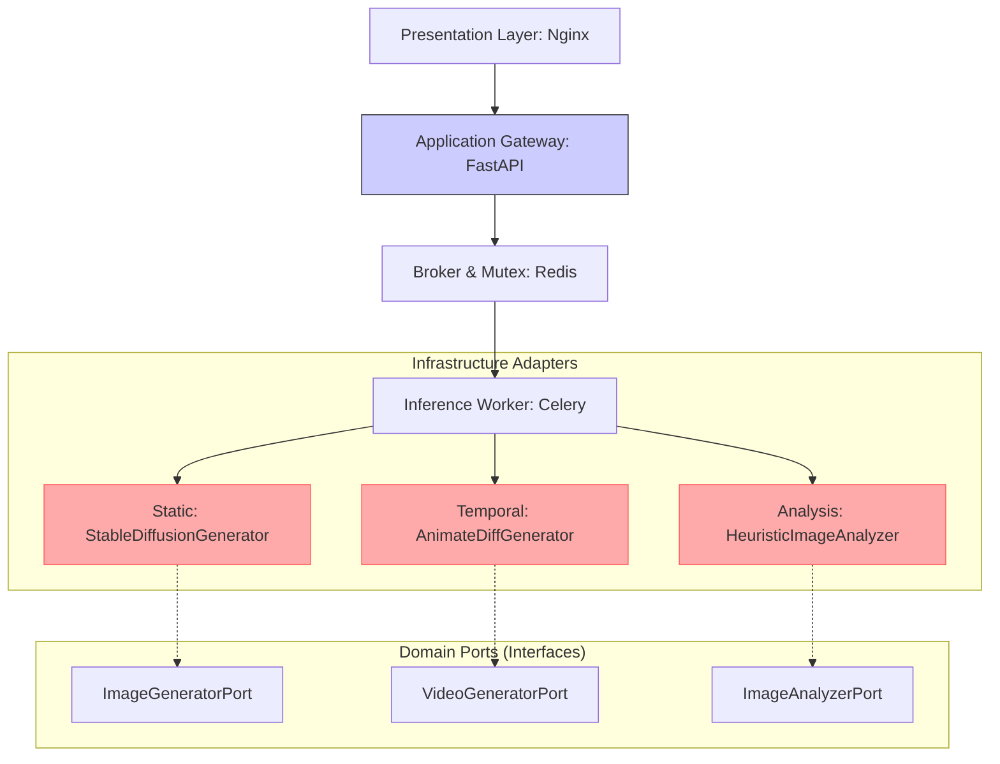
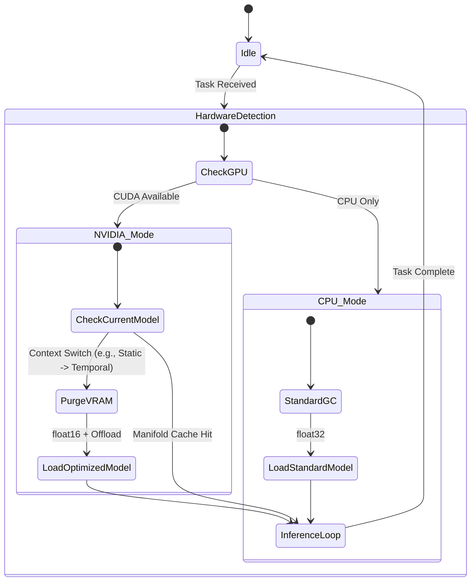
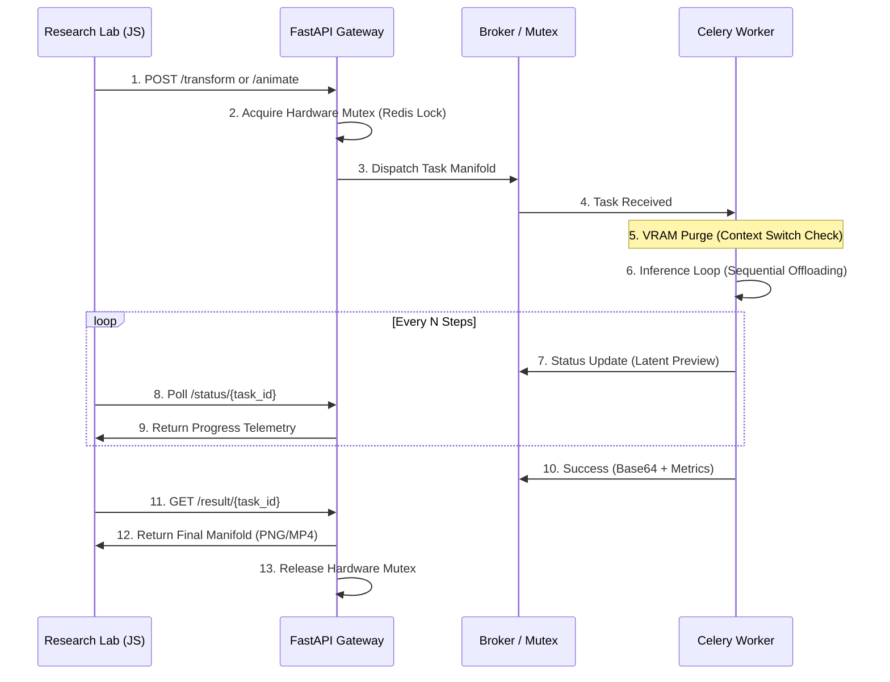

# 🐉 Z-Realism AI: Multi-Modal Research Institute (v21.8 Stable)

[](https://www.docker.com/)
[](https://fastapi.tiangolo.com/)
[](https://docs.celeryq.dev/)
[](http://localhost:8080)
[](#system-architecture-hexagonal--ddd)
[](LICENSE)

**Z-Realism AI** is a professional-grade, domain-driven generative AI ecosystem engineered for the photorealistic synthesis of 2D characters into high-fidelity "Live Action" human counterparts. This version (v21.8) introduces the **Temporal Fusion Engine** (AnimateDiff) and a **Hybrid Hardware Orchestrator** designed to maximize inference performance on limited VRAM environments (NVIDIA GTX 1060 6GB) by utilizing system RAM (32GB) as a high-latency latent buffer.

**Author:** Enrique González Gutiérrez <enrique.gonzalez.gutierrez@gmail.com>

---

## 🔬 Scientific & Technical Thesis

The core thesis of Z-Realism is the solution to the **Structural and Chromatic Drift Problems**—ensuring the geometric and color integrity of the source image is maintained during high-entropy neural style transfer and temporal animation.

### Key Engineering Contributions:
*   **Context-Aware Pre-processing:** The system intelligently analyzes the source manifold's background (transparent, black, or scenic) and adapts the diffusion process to prevent contrast leaks and color desaturation.
*   **Hierarchical Conditioning:** Utilizes dual-stage neural conditioning with **ControlNet (Depth + OpenPose)** to anchor pose and geometry before injecting cinematic textures from the base model.
*   **Temporal Consistency Engine:** Implements **AnimateDiff v1.5** with a motion-adapter to infuse life into static manifolds while preserving character metadata across the temporal sequence.
*   **Hybrid Hardware Orchestration:** Automatically detects **CUDA vs. CPU** environments. On GPU, it enforces **Aggressive VRAM Purging** and **Sequential CPU Offloading** to enable 1024px video generation on 6GB cards.
*   **Multivariate Evaluation:** A scientific assessment engine using **Laplacian Edge Fidelity**, **CIELAB Color Moment Analysis**, and **Relative Shannon Entropy** to quantitatively measure textural realism gain.

---

## 🏗 System Architecture (Hexagonal / DDD)

The system adheres strictly to **Domain-Driven Design (DDD)** and the **Hexagonal Architecture** pattern. The core business logic (Use Cases) is isolated from infrastructure adapters (PyTorch, FastAPI, Celery).

### Infrastructure Manifold



### Hybrid Resource Management Flow



### Asynchronous Data Flow & Task Orchestration



---

## 🛠 Tech Stack

- **Generative AI:** Stable Diffusion 1.5 (Realistic Vision V5.1), AnimateDiff v1.5, ControlNet (Depth/Pose).
- **Backend Infrastructure:** FastAPI, Celery, Redis (Message Broker & Mutex).
- **Computer Vision:** OpenCV (Evaluation Engine), MediaPipe/Midas (Pre-processors).
- **Frontend Architecture:** Modular HTML5/CSS3/JS with a Cyber-Lab aesthetic.
- **DevOps & Scaling:** Docker, Docker Compose, GNU Make (Hardware-aware deployment).

---

## 🚦 Getting Started

### Prerequisites
- Docker & Docker Compose.
- **For GPU Mode:** NVIDIA Container Toolkit (GTX 1060 6GB+ recommended).
- **For CPU Mode:** Minimum 32GB System RAM recommended for temporal synthesis.

### Installation & Launch

1.  **Clone the research manifold.**
2.  **Clean the environment (Highly Recommended for Reproducibility):** This command performs a deep clean to prevent Docker caching issues.
    ```bash
    make prune
    ```
3.  **Build the ecosystem:** This downloads the multi-gigabyte neural weights and builds the CUDA-ready containers.
    ```bash
    make build
    ```
4.  **Initiate services:** The Makefile auto-detects your hardware and loads the appropriate configuration.
    ```bash
    make up
    ```
5.  **Monitor AI Cold Start:** Use the logs to see when the models are fully synchronized in RAM/VRAM.
    ```bash
    make logs-worker
    ```

### Remote Research & Mobile Testing
To test the interface on a mobile device or share the lab with peers:
```bash
make share
```
*Note: The frontend `api.js` automatically detects the Ngrok tunnel and adjusts its `API_BASE_URL` dynamically.*

---

## 🧪 Operational Commands (Makefile)

| Command | Description |
| :--- | :--- |
| `make up` | Start all research nodes (Auto-detects GPU/CPU). |
| `make down` | Graceful shutdown of the ecosystem. |
| `make share` | Expose the UI to the internet via Ngrok for remote testing. |
| `make logs-worker`| Stream real-time inference telemetry and VRAM management logs. |
| `make stats` | Display Docker resource utilization (CPU/GPU/RAM). |
| `make clean-model`| **DANGER:** Purge local model cache volume (forces re-download). |
| `make prune` | **DANGER:** Complete system wipe (containers, images, volumes). |

---

## 🔒 Privacy, Ethics & Licensing

**Z-Realism AI** is designed for local, offline operation. No data leaves your machine unless you explicitly activate external tunnels.

*   **Software License:** MIT License (Copyright 2024 Enrique González Gutiérrez).
*   **AI Model License:** Core models are subject to the **CreativeML Open RAIL-M License**. Users are responsible for ensuring ethical usage in compliance with these terms.
*   **Neural Cache:** The system uses functional session tokens to track Task UUIDs, ensuring continuity during long-latency inference. No personal metadata is stored.