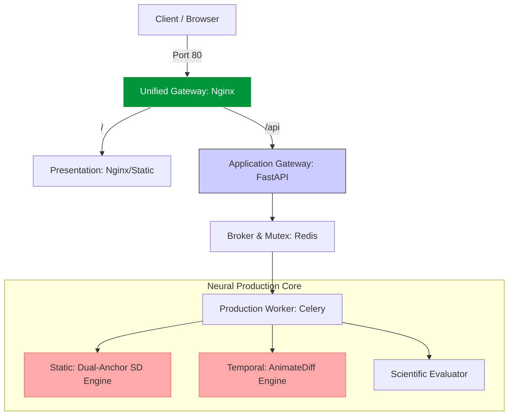
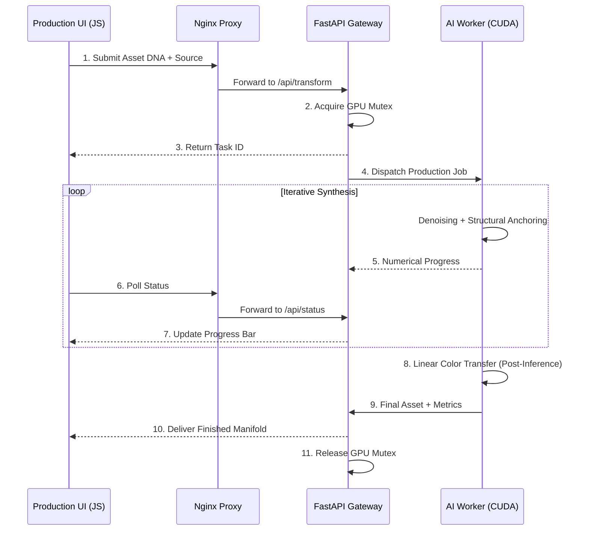

# 🐉 Z-Realism AI: High-Fidelity Neural Production Studio (v1.0.0)

[](https://www.docker.com/)
[](https://nginx.org/)
[](https://fastapi.tiangolo.com/)
[](#internationalization-i18n)
[](#system-architecture-hexagonal--ddd)
[](LICENSE)

**Z-Realism AI** is a professional-grade, commercial production studio engineered for the photorealistic synthesis of 2D artistic assets into high-fidelity "Live Action" visuals. Optimized for both static imagery and cinematic motion, the system utilizes a **Unified Gateway Architecture** to deliver a seamless, responsive experience on global networks, even when running on limited consumer hardware (NVIDIA GTX 1060 6GB).

**Author:** Enrique González Gutiérrez <enrique.gonzalez.gutierrez@gmail.com>

---

## 🚀 Commercial Value Proposition

The core strength of Z-Realism lies in its **Subject DNA Preservation** protocol. Unlike generic AI models, our system anchors the original identity, colors, and structure of your artwork, transforming it into reality without losing the essence of the creator's vision.

### Key Production Features:
*   **Unified Production Gateway:** Powered by Nginx, providing a single entry point for UI and API, eliminating CORS conflicts and simplifying remote deployments (Ngrok-ready).
*   **Agnostic Material Synthesis:** The engine intelligently translates colors and shapes from source art into realistic textures (skin, fabric, metal) using a post-inference **Linear Chromatic Anchor**.
*   **Dual-Anchor Structural Logic:** Combines **Depth-Mapping** and **Canny Edge Detection** to ensure 1:1 geometric alignment between the original sketch and the final photo.
*   **Global Readiness:** Fully localized interface (English/Spanish) powered by a decoupled **SOLID-compliant i18n Engine**.
*   **Hardware Efficiency:** Proprietary VRAM orchestration enables high-resolution production (up to 1024px) on 6GB cards through sequential offloading and nearest-multiple rounding.

---

## 🏗 System Architecture (Hexagonal / DDD)

The system architecture is designed for scalability and maintainability, isolating the generative core from the delivery infrastructure.

### Infrastructure Manifold (Unified Gateway)



### Production Workflow Sequence



---

## 🛠 Tech Stack

- **Inference Engine:** Stable Diffusion 1.5 (Realistic Vision V5.1), AnimateDiff v1.5, ControlNet (Depth/Canny).
- **Architecture:** Hexagonal (Ports & Adapters), DDD, SOLID Principles.
- **Backend:** Python, FastAPI, Celery, Redis.
- **Frontend:** HTML5, CSS3 (Modern Responsive UI), Vanilla JS, i18n-Engine.
- **DevOps:** Nginx (Reverse Proxy), Docker, GNU Make.

---

## 🚦 Getting Started

### Prerequisites
- Docker & Docker Compose.
- NVIDIA Container Toolkit (For GPU acceleration).

### Installation & Launch

1.  **Clone the production manifold.**
2.  **Initialize the Studio:**
    ```bash
    make build
    make up
    ```
3.  **Global Access (Ngrok):**
    To share the production lab with external clients or test on mobile devices:
    ```bash
    make share
    ```
    *Note: The Unified Gateway handles all routing through a single public URL.*

---

## 🧪 Operational Commands

| Command | Description |
| :--- | :--- |
| `make up` | Start the Production Studio (Nginx + UI + API + Worker). |
| `make down` | Graceful shutdown of all services. |
| `make share` | Generate a single public link for global access. |
| `make logs-worker`| Monitor real-time AI synthesis and hardware telemetry. |
| `make prune` | **DANGER:** Full system reset and cache purge. |

---

## 🔒 Privacy & Compliance

**Z-Realism Studio** operates under a "Privacy by Design" philosophy. All asset processing occurs within your local isolated environment.

*   **Software License:** MIT License.
*   **Ethical AI:** Adheres to the **CreativeML Open RAIL-M** standards. Users retain 100% ownership of original artwork and derived outputs generated through the platform.
*   **Data Sovereignty:** No user data or artistic assets are ever transmitted to third-party servers.

---
**Commercial Production Ready // v1.0.0 Stable**