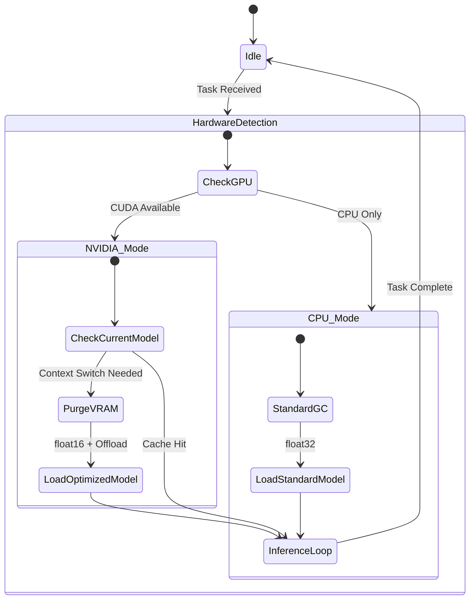
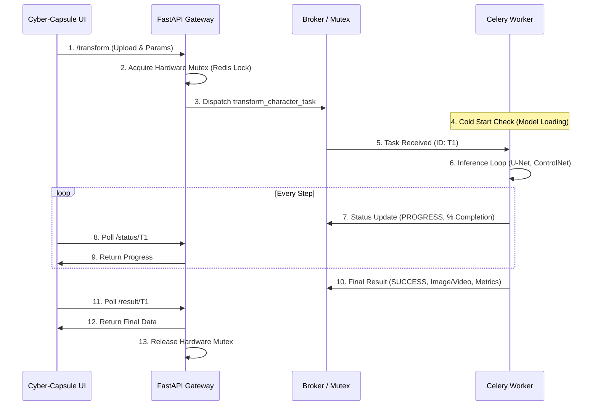

# 🐉 Z-Realism AI: Dragon Ball Live-Action Engine (v20.2 Multi-Modal)

[](https://www.docker.com/)
[](https://fastapi.tiangolo.com/)
[](https://docs.celeryq.dev/)
[](http://localhost)
[](#system-architecture-hexagonal--ddd)
[](LICENSE)

**Z-Realism AI** is a professional-grade, domain-driven generative AI ecosystem engineered for the photorealistic synthesis of 2D characters into high-fidelity "Live Action" human counterparts. This research platform utilizes a meticulously optimized **Stable Diffusion (SD) 1.5** pipeline augmented with dual structural conditioning and a restored **Original Fidelity Protocol** to ensure strict color preservation.

**Update v20.2:** Now featuring **Temporal Fusion (AnimateDiff)** to transform generated stills into fluid, cinematic video clips, with a specialized **Hybrid Hardware Architecture** that runs on both high-end Workstations and modest Laptops (GTX 1060 6GB).

**Author:** Enrique González Gutiérrez <enrique.gonzalez.gutierrez@gmail.com>

---

## 🔬 Scientific & Technical Thesis

The core thesis of Z-Realism is the solution to the **Structural and Chromatic Drift Problems**—ensuring the geometric and color integrity of the source image is maintained during style transfer. We achieve cinematic realism through focused control of the stochastic de-noising process.

### Key Architectural Features:
*   **Restored Fidelity Protocol:** The engine uses a hybrid prompt structure and white-background image pre-processing (v19.7) to lock onto the source image's color palette, mitigating saturation loss common in high-strength Img2Img pipelines.
*   **Hierarchical Conditioning:** Utilizes a dual-stage neural architecture with **ControlNet (Depth + OpenPose)** to precisely anchor pose and geometry, allowing high structural control with medium denoising strength.
*   **Multivariate Evaluation:** Implements a scientific assessment engine using **Laplacian Edge Fidelity** and **LAB Color Moment Analysis** (plus the new **Textural Realism** score) to quantitatively track the preservation of identity.
*   **Adaptive Heuristics:** The system incorporates the **Heuristic Image Analyzer** which dynamically recommends hyper-parameters (ControlNet scale, denoising ratios) based on the structural density of the input image.
*   **Hybrid Hardware Orchestration (v20.2):**
    *   **On GPU (GTX 1060):** Implements **Aggressive VRAM Garbage Collection** and **Sequential CPU Offloading**, treating System RAM (32GB) as a massive VRAM buffer to enable 1024px video generation on 6GB cards.
    *   **On CPU:** Automatically degrades to `float32` precision and standard RAM management for full compatibility on non-NVIDIA hardware.
*   **Granular Telemetry:** The Celery worker reports detailed **Lifecycle States** (`LOADING_MODELS`, `ALLOCATING_VRAM`, `SYNTHESIZING`) for full transparency during the "Cold Start" phase.

---

## 🏗 System Architecture (Hexagonal / DDD)

The system adheres strictly to Domain-Driven Design (DDD) principles, ensuring that the core business logic (Use Cases) remains independent of the underlying technology (PyTorch/FastAPI).

### Domain-Driven Design Layers

```mermaid
graph TD
    A[Presentation: UI / Nginx] --> B(Application: Use Cases);
    B --> C[Domain: Ports & Entities];
    C --> D[Infrastructure: Adapters];

    subgraph Domain Boundary
        C
        B
    end

    subgraph Infrastructure
        D
        E[Adapter: StableDiffusionGenerator]
        F[Adapter: VideoGenerator (AnimateDiff)]
        G[Adapter: Celery / Redis]
        H[Adapter: FastAPI Gateway]
        D --> E;
        D --> F;
        D --> G;
        D --> H;
    end
    
    style C fill:#f9f,stroke:#333,stroke-width:2px;
    style B fill:#ccf,stroke:#333;
    style E fill:#faa,stroke:#f66,stroke-width:2px;
    style F fill:#aaf,stroke:#66f,stroke-width:2px;
```

### Hybrid Resource Management Flow

This diagram illustrates how the Worker dynamically manages memory based on the detected hardware and task type.



### Asynchronous Data Flow & Task Orchestration



---

## 🛠 Tech Stack

- **AI Core (Static):** Stable Diffusion 1.5 (Realistic Vision V5.1), Dual ControlNet (Depth, OpenPose).
- **AI Core (Temporal):** AnimateDiff v1.5 with Motion LoRA Adapter.
- **Backend/Gateway:** FastAPI (Python).
- **Task Management:** Celery & Redis (Broker/Backend).
- **Frontend:** Custom Nginx (HTML/CSS/JS Cyber-Capsule UI).
- **DevOps:** Docker, Docker Compose, GNU Make (Hardware-aware deployment).

---

## 🚦 Getting Started

The project includes an intelligent `Makefile` that automatically detects if your system has an NVIDIA GPU and configures the containers accordingly.

### Prerequisites
- Docker & Docker Compose.
- **For GPU Mode:** NVIDIA Container Toolkit (GTX 1060 6GB+ recommended).
- **For CPU Mode:** Minimum 16GB RAM (32GB recommended for video).

### Installation & Launch

1.  **Clone the repository and enter the directory.**
2.  **Build the ecosystem:** This step downloads the multi-gigabyte models (SD, ControlNets) and builds the Python environment.
    ```bash
    make build
    ```
3.  **Start all services:** 
    ```bash
    make up
    ```
    *   *If GPU is detected:* Loads `docker-compose.gpu.yml` and activates CUDA optimizations.
    *   *If CPU only:* Loads standard containers and runs in compatibility mode.

4.  **Monitor the AI Cold Start:** Wait for the `z-realism-worker` to finish loading the models before using the UI.
    ```bash
    make logs-worker
    ```

### Accessing the System
- **Control Studio (Custom UI):** [http://localhost](http://localhost)
- **API Documentation (Swagger):** [http://localhost:8000/docs](http://localhost:8000/docs)
- **Expert Dashboard (Streamlit):** [http://localhost:8501](http://localhost:8501)

---

## 🧪 Development & Maintenance (Advanced Commands)

| Command | Description |
| :--- | :--- |
| `make logs-worker` | Stream the AI's internal processing and lifecycle telemetry. |
| `make shell-worker` | Access the terminal inside the Worker container. |
| `make restart` | Quick restart of all services (use after code changes in mounted volumes). |
| `make down` | Stop and remove all containers gracefully. |
| `make clean-model` | **DANGER:** Removes the `hf_cache` model volume (forces re-download on next startup). |
| `make prune` | **DANGER:** Complete system wipe (containers, volumes, images). |

---

## 🔒 Privacy & Licensing

**Z-Realism AI** is designed for local, offline operation. No data leaves your machine once the initial models are downloaded, ensuring input/output privacy.

**Code License:** MIT License (Copyright 2024 Enrique González Gutiérrez)

**AI Model License Notice:**
The core models (Stable Diffusion 1.5, ControlNet, AnimateDiff) are subject to the **CreativeML Open RAIL-M License**. Users must ensure compliance with these terms, which govern responsible usage.

---